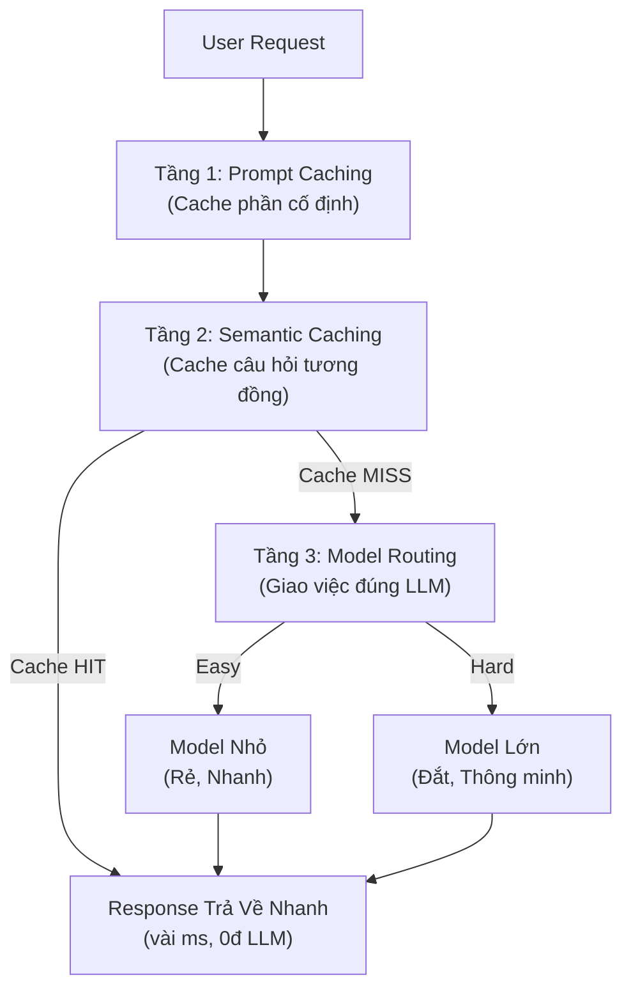

# Advanced Phase 2: Tư Duy Cốt Lõi — Bộ Lọc 3 Tầng (The 3-Layer Filter)

> Để tối ưu một request từ người dùng, chúng ta sẽ cho nó đi qua một bộ lọc giảm cấp. Mục tiêu tối thượng: **Xử lý càng sớm, càng rẻ, càng nhanh càng tốt.**

---

## 1. Tổng Quan Kiến Trúc 3 Tầng

Bộ lọc 3 tầng giúp tiết kiệm chi phí API, giảm độ trễ (latency), và tối ưu hóa việc sử dụng tài nguyên (đặc biệt khi scale hệ thống Legal AI lên hàng ngàn người dùng).



| Tầng | Vai trò | Mục tiêu | Lợi ích |
|------|---------|----------|----------|
| **1. Prompt Caching** | Tối ưu phần văn bản cố định, lặp đi lặp lại. | Giảm chi phí token hệ thống. | Tiết kiệm 50%-90% chi phí Context. |
| **2. Semantic Caching** | Dùng lại câu trả lời cũ cho câu hỏi tương tự. | Bỏ qua hoàn toàn việc gọi LLM. | Tiết kiệm 100% token, Latency ~0. |
| **3. Model Routing** | Phân loại câu hỏi Khó/Dễ để điều hướng. | Dùng đúng model cho đúng việc. | Tối ưu chi phí & chất lượng. |

---

## 2. Tầng 1: Prompt Caching — Tối ưu phần "Cố định"

### Khái niệm & Cơ chế

Mỗi lần user gửi câu hỏi, hệ thống thường phải nhồi thêm một lượng lớn **System Prompt** (Luật lệ, context, tài liệu RAG, vài ví dụ few-shot). Nếu 1,000 user cùng hỏi, LLM sẽ phải "đọc lại" đống tài liệu đó 1,000 lần. Rất lãng phí!

Prompt Caching lưu lại trạng thái xử lý (KV Cache) của phần văn bản trùng lặp đó ở phía Server (hoặc trên vLLM/Local).

### Điểm mấu chốt cho Kỹ sư (The Golden Rule)

**Nguyên tắc: Tĩnh trước, động sau.**

Cơ chế cache của các bên chỉ kích hoạt khi phần Prefix (đoạn đầu) khớp chính xác từng ký tự. Do đó, cấu trúc Prompt luôn luôn phải là:

```text
[System Prompt cố định] -> [Tài liệu Context RAG cố định] -> [Câu hỏi thay đổi của User]
```

**⚠️ Sai lầm:** Nếu bạn để câu hỏi của user lên đầu tiên, toàn bộ phần cache phía sau sẽ bị vô hiệu hóa (Cache MISS).

**Kinh tế học:** Token được cache thường rẻ hơn từ 50% đến 90% và giảm đáng kể thời gian xử lý token đầu tiên (TTFT).

---

## 3. Tầng 2: Semantic Caching — Tối ưu bằng sự "Tương đồng"

### Cơ chế hoạt động

Khác với Cache thông thường (phải giống nhau từng ký tự, dùng cho hệ thống), **Semantic Caching** dùng Vector Embedding để hiểu ý nghĩa câu hỏi của người dùng.

1. User hỏi câu $A'$.
2. Nhúng $A'$ thành vector, quét trong Vector Store xem trước đây có câu $A$ nào khớp đến 92-95% về ngữ nghĩa không.
3. Nếu có (**Cache HIT**), bốc luôn câu trả lời của $A$ trả cho user. Không tốn một đồng nào cho LLM, latency chỉ vài mili-giây.

### Những lưu ý xương máu khi triển khai

**1. Bài toán Threshold (Ngưỡng):**
- Đặt **quá thấp** (ví dụ 0.85): Rủi ro "râu ông nọ cắm cằm bà kia" (False Positive) cực cao. Hệ thống sẽ trả về câu trả lời sai ngữ cảnh.
- Đặt **quá cao** (ví dụ 0.98): Hầu như không bao giờ hit cache, viết code ra bằng thừa.
- *Khuyến nghị:* Nên dùng khoảng 0.93 - 0.95 và liên tục tinh chỉnh.

**2. Tính tươi của dữ liệu (Data Freshness):**
- Không bao giờ dùng Semantic Cache cho các câu hỏi mang tính thời gian thực (ví dụ: "Luật bảo hiểm mới nhất hôm nay", "Giá vàng").
- Phải cài đặt **TTL (Time-To-Live)** để ép cache invalidate sau một khoảng thời gian (ví dụ: 7 ngày đối với luật).

---

## 4. Tầng 3: Model Routing — Giao đúng người, đúng việc

Nếu request vượt qua cả 2 tầng cache trên, bắt buộc phải dùng LLM. Lúc này ta dùng **Router**. Một nguyên tắc tối thượng trong thiết kế hệ thống là: *Router phải cực nhẹ, chạy cực nhanh và chi phí gần như bằng 0 so với các LLM phía sau.*

Có 3 chiến lược thiết kế Router từ dễ đến khó:

### 4.1. Rule-based Routing (Dựa trên luật)

- **Cách làm:** Dùng code regex hoặc đếm số lượng chữ (token), check từ khóa chứa trong câu hỏi.
  - *Ví dụ:* Nếu câu hỏi > 500 từ, hoặc chứa từ "so sánh", "tổng hợp" → đưa sang Model lớn. Nếu chỉ hỏi "Điều 4 là gì" → Model nhỏ.
- **Đánh giá:** Nhanh, không tốn tiền, nhưng cùn và khó duy trì khi hệ thống phức tạp lên.

### 4.2. Embedding Similarity Routing (Dựa trên câu mẫu)

- **Cách làm:** Chuẩn bị sẵn một bộ các câu hỏi mẫu đại diện cho nhóm "Dễ" và nhóm "Khó". Tính toán vector trung tâm (Centroid) cho từng nhóm. Khi có query mới, chỉ cần embed nó lên rồi xem nó gần nhóm nào hơn thì chuyển về model đó.
- **Đánh giá:** Linh hoạt, hiểu ngữ nghĩa, không cần train lại model, chỉ cần tinh chỉnh bộ câu hỏi mẫu.

### 4.3. Fine-tuned Small Classifier (Mô hình phân loại nhỏ)

- **Cách làm:** Train một model học máy truyền thống (như Logistic Regression, SVM) hoặc một kiến trúc BERT nhỏ để "ngửi" query và phân loại thẳng ra nhãn Easy hay Hard.
- **Mẹo tạo Data để train Router (LLM-as-judge):**
  1. Cho cả hai model (Nhỏ và Lớn) chạy trên cùng một tập data test lớn.
  2. Dùng một model Flagship (như GPT-4o) chấm điểm output của cả hai.
  3. Nếu model nhỏ đạt điểm bằng hoặc gần bằng model lớn $\rightarrow$ Gán nhãn câu hỏi đó là **Easy**.
  4. Nếu model nhỏ thua đứt đuôi $\rightarrow$ Gán nhãn là **Hard**.
  5. Dùng tập data này để train mô hình phân loại của bạn.

### Bảng so sánh nhanh 3 phương pháp Routing

| Tiêu chí | Rule-based | Embedding Similarity | Fine-tuned Classifier |
|----------|------------|----------------------|-----------------------|
| **Độ trễ (Latency)** | Gần như 0 ms | Vài ms (1 lần embed) | Vài ms |
| **Chi phí** | 0 | Rất thấp | Rất thấp |
| **Độ chính xác** | Thấp | Trung bình | Cao nhất |
| **Độ phức tạp** | Thấp (Viết luật tay) | Trung bình | Cao (Cần data và pipeline train) |
