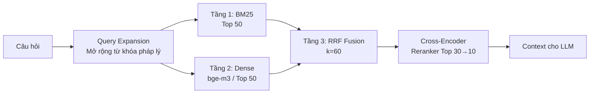

# Phase 2: Multi-Layer Hybrid Retrieval

> Khối não tìm kiếm của hệ thống. Khi User hỏi "vốn điều lệ doanh nghiệp nhỏ quy định thế nào?", hệ thống phải bốc đúng Điều luật trong hàng chục ngàn văn bản.

---

## 1. Pipeline Retrieval 3 Tầng



---

## 2. Chi Tiết Từng Tầng

### Tầng 1: BM25 (Sparse / Lexical Retrieval)

- **Thư viện:** `rank_bm25` (BM25Okapi)
- **Tokenizer:** Regex Legal Phrases + Vietnamese bigrams (tránh dùng `underthesea` do hang trên Colab)
- **Tham số:** k1=1.5, b=0.75
- **Output:** Top 50 kết quả

**Ưu điểm:** Bắt chính xác các thực thể cứng: `"Điều 4"`, `"04/2017/QH14"`, `"vốn điều lệ"`.

**Legal Phrases Tokenizer:** Thay vì cắt từ đơn, tokenizer nhận diện cụm pháp lý ghép như `"doanh_nghiệp_nhỏ_và_vừa"`, `"bảo_hiểm_xã_hội"`, `"xử_phạt_vi_phạm_hành_chính"` để tăng precision.

### Tầng 2: Dense Retrieval (Vector / Semantic Search)

- **Model:** `BAAI/bge-m3` (568M params, 1024-dim, multilingual — hỗ trợ tiếng Việt tốt)
- **Fallback:** `bkai-foundation-models/vietnamese-bi-encoder`
- **Storage:** Qdrant persistent (embedded mode, lưu xuống ổ cứng)
- **Output:** Top 50 kết quả

**Ưu điểm:** Bắt ý nghĩa ngầm định — User hỏi "phạt chậm nộp thuế", model hiểu liên quan đến "xử lý vi phạm hành chính về thuế".

### Tầng 3: RRF Fusion + Cross-Encoder Reranking

**Reciprocal Rank Fusion** trộn 2 danh sách:

```
RRF(d) = Σ 1/(k + rank_i(d))    với k = 60
```

Sau RRF → lấy **Top 30** → đẩy qua **Cross-Encoder Reranker**:

- **Model:** `BAAI/bge-reranker-v2-m3`
- Reranker "đọc" trực tiếp cặp (Câu hỏi, Đoạn luật) → cho điểm [0, 1]
- **Scoring kết hợp:** `0.8 × rerank_score + 0.2 × rrf_score + lexical_boost`

**Lexical Boost** (từ AIGuru): Cộng thêm điểm nếu chunk chứa doc_id hoặc article_number khớp với câu hỏi. Trừ điểm nếu chunk không eligible cho submission.

---

## 3. Query Expansion (Mở Rộng Truy Vấn)

Trước khi truy vấn, câu hỏi được mở rộng tự động bằng bảng ánh xạ domain:

| Nếu câu hỏi chứa | Thêm vào query |
|-------------------|----------------|
| "doanh nghiệp nhỏ và vừa", "dnnvv" | "Luật hỗ trợ doanh nghiệp nhỏ và vừa nghị định hướng dẫn" |
| "người lao động", "hợp đồng lao động" | "Bộ luật Lao động xử phạt vi phạm lao động" |
| "thuế", "khai thuế", "chậm nộp" | "Luật Quản lý thuế xử phạt vi phạm hành chính về thuế" |
| "bảo hiểm xã hội", "bhxh" | "Luật Bảo hiểm xã hội xử phạt chậm đóng" |
| "hợp đồng", "thương mại" | "Luật Thương mại Bộ luật Dân sự hợp đồng" |

---

## 4. Dynamic Thresholding (Tối Ưu Recall)

Hệ thống dùng ngưỡng động thay vì top-K cứng:

```text
Config:
  SAFE_THRESHOLD      = 0.3    (Ngưỡng thấp — lấy nhiều context cho LLM)
  HIGH_CONF_THRESHOLD = 0.5    (Ngưỡng cao — chỉ giữ chunk tin cậy)
  MAX_ARTICLES        = 10
  MIN_HIGH_CONF       = 3      (Đảm bảo ít nhất 3 kết quả)

Logic:
  1. Lấy chunks có score ≥ HIGH_CONF_THRESHOLD → tối đa MAX_ARTICLES
  2. Nếu < MIN_HIGH_CONF kết quả → hạ xuống SAFE_THRESHOLD
  3. Nếu vẫn < MIN_HIGH_CONF → lấy top MIN_HIGH_CONF bất kể score
  4. Nếu top-1 score < 0.3 → kích hoạt "Safe Response Mode"
```

> **Triết lý:** Thà bắt nhầm hơn bỏ sót — phù hợp với F2 metric trọng Recall gấp 4 lần Precision.

---

## 5. Context Formatting (Chống Xung Đột Số Hiệu)

Khi nhiều văn bản cùng có "Điều 4" (VD: Luật 04/2017/QH14 vs Nghị định 80/2021/NĐ-CP), format tường minh:

```markdown
=== CƠ SỞ DỮ LIỆU THAM CHIẾU ===

[VĂN BẢN 1]: Luật 04/2017/QH14 - Luật Hỗ trợ doanh nghiệp nhỏ và vừa
- Nội dung Điều 4: {chunk_text}
  [TRÍCH DẪN HỢP LỆ]: 04/2017/QH14|...|Điều 4

[VĂN BẢN 2]: Nghị định 80/2021/NĐ-CP - Hướng dẫn Luật Hỗ trợ DNNVV
- Nội dung Điều 4: {chunk_text}
  [TRÍCH DẪN HỢP LỆ]: 80/2021/NĐ-CP|...|Điều 4
```

**Thuật toán:** Group chunks theo `doc_id` → sort theo `article_number` → render headers `[VĂN BẢN N]` → kèm tag `[TRÍCH DẪN HỢP LỆ]` cho LLM biết chỉ được trích dẫn những cái này.

---

## 6. Cấu Hình Tham Số

| Tham số | Giá trị | Mô tả |
|---------|---------|-------|
| `BM25_TOP_K` | 50 | Số kết quả BM25 |
| `DENSE_TOP_K` | 50 | Số kết quả Dense |
| `RRF_K` | 60 | Hằng số RRF |
| `RRF_TOP_K` | 30 | Candidates cho Reranker |
| `RERANKER_BATCH_SIZE` | 16 | Batch size Cross-Encoder |
| `EMBEDDING_MODEL` | `BAAI/bge-m3` | Model nhúng |
| `RERANKER_MODEL` | `BAAI/bge-reranker-v2-m3` | Model Reranker |
