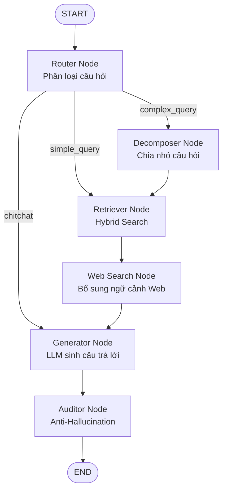

# Phase 3: LangGraph Multi-Agent System

> Thay vì gọi `llm.generate()` đơn lẻ rồi cầu nguyện, hệ thống chuyển ngữ cảnh qua một luồng "suy luận đa tác tử" — mỗi Node chịu trách nhiệm một bước, giống luồng duyệt hồ sơ pháp lý của con người.

---

## 1. Đồ Thị Trạng Thái (State Graph)



### ChatState (Trạng thái luân chuyển qua Graph)

```python
from typing import TypedDict, List, Optional

class ChatState(TypedDict):
    # --- Input ---
    question: str                          # Câu hỏi hiện tại của người dùng
    chat_history: List[dict]               # Lịch sử hội thoại [{role, content}, ...]

    # --- Decomposition (MỚI) ---
    query_type: str                        # "simple_query" | "complex_query" | "chitchat"
    sub_queries: List[str]                 # Các câu hỏi nhỏ được tách ra từ câu gốc

    # --- Retrieval ---
    contexts: List[dict]                   # Danh sách KnowledgeChunk tìm được (DB + Web)
    relevant_articles: List[str]           # formatted_article từ eligible chunks
    relevant_docs: List[str]               # formatted_doc (deduplicated)
    web_search_used: bool                  # Cờ đánh dấu hệ thống đã dùng Web Search

    # --- Generation ---
    draft_answer: str                      # Câu trả lời nháp từ LLM

    # --- Auditing ---
    hallucinated_articles: List[str]       # Điều bị phát hiện bịa
    final_answer: str                      # Câu trả lời sau khi rà soát
    citations: List[dict]                  # Metadata nguồn để UI hiển thị
```

---

## 2. Các Node Chi Tiết

### 2.1 Router Node (`nodes/router.py`)

**Nhiệm vụ:** Phân loại câu hỏi để quyết định đường đi.

| Loại câu hỏi    | Ví dụ                                                    | Hành động             |
| --------------- | -------------------------------------------------------- | --------------------- |
| `complex_query` | "Thành lập cty TNHH 1 TV cần gì và đóng thuế bao nhiêu?" | → **Decomposer Node** |
| `simple_query`  | "Vốn điều lệ tối thiểu là bao nhiêu?"                    | → **Retriever Node**  |
| `chitchat`      | "Xin chào", "Cảm ơn bạn"                                 | → **Generator Node**  |

---

### 2.2 Decomposer Node (`nodes/decomposer.py`) 🌟 MỚI

**Nhiệm vụ:** Đóng vai trò là một **Sub-agent**, sử dụng LLM để "chẻ" một câu hỏi pháp lý phức tạp (chứa nhiều vế) thành các câu hỏi đơn giản hơn. Việc này giúp Hybrid Search + Reranker bám sát từng vế, tránh bị loãng thông tin do truy vấn quá dài.

**Ví dụ:**

- _Input:_ "Công ty tôi phá sản thì nợ lương nhân viên và nợ thuế nhà nước giải quyết thứ tự như thế nào?"
- _Output (sub_queries):_
  1. "Quy định về thứ tự thanh toán nợ lương nhân viên khi doanh nghiệp phá sản."
  2. "Quy định về thứ tự thanh toán nợ thuế nhà nước khi doanh nghiệp phá sản."

---

### 2.3 Retriever Node (`nodes/retriever.py`)

**Nhiệm vụ:**

- Nếu `sub_queries` tồn tại: Duyệt qua từng câu hỏi nhỏ, gọi hàm `retrieve_with_rerank()` cho mỗi câu, sau đó gộp chung kết quả và loại bỏ các chunk bị trùng (Deduplication).
- Nếu chỉ có `question` gốc: Tiến hành truy xuất như bình thường.

---

### 2.4 Web Search Node (`nodes/web_search.py`) 🌟 MỚI

**Nhiệm vụ:** Hoạt động như một **Tool/Fallback** bổ sung kiến thức thực tế (thời gian thực) hoặc các bộ luật mới nhất chưa kịp cập nhật vào Qdrant Database cục bộ.

**Logic hoạt động:**

1. **Trigger (Điều kiện kích hoạt):** Kiểm tra điểm số (Score) của các chunk từ Retriever. Nếu kết quả trả về quá ít hoặc điểm Reranker của tất cả các chunk đều `< 0.60` (ngưỡng tin cậy thấp), chứng tỏ DB nội bộ không có đáp án.
2. **Action:** Gọi Tool Web Search (khuyến nghị dùng `Tavily API` vì nó tối ưu cho RAG, hoặc `DuckDuckGo` nếu muốn miễn phí).
3. **Augment:** Chuyển đổi các snippet từ Web thành đối tượng `KnowledgeChunk`, đẩy ngược vào mảng `state["contexts"]` và set `web_search_used = True`.

---

### 2.5 Generator Node (`nodes/generator.py`)

**Nhiệm vụ:** Gọi LLM sinh câu trả lời dựa trên Context đã được format.
_Prompt được tinh chỉnh: Nhắc LLM tổng hợp thông tin từ nhiều khía cạnh (nếu có sub_queries) và chú thích nguồn từ Web nếu `web_search_used == True`._

---

### 2.6 Auditor Node (`nodes/auditor.py`)

**Nhiệm vụ:** "Thanh tra viên" — rà soát câu trả lời trước khi gửi cho người dùng. Đối soát trích dẫn (Điều X) trong `draft_answer` với `metadata` trong `contexts`.

---

## 3. Xây Dựng Graph (graph.py)

```python
from langgraph.graph import StateGraph, END

workflow = StateGraph(ChatState)

# Thêm nodes
workflow.add_node("router", router_node)
workflow.add_node("decomposer", decomposer_node)
workflow.add_node("retriever", retriever_node)
workflow.add_node("web_search", web_search_node)
workflow.add_node("generator", generator_node)
workflow.add_node("auditor", auditor_node)

# Nối edges
workflow.set_entry_point("router")

# Router quyết định đi đâu
workflow.add_conditional_edges("router", route_decision, {
    "complex_query": "decomposer",
    "simple_query": "retriever",
    "chitchat": "generator",
})

workflow.add_edge("decomposer", "retriever")
workflow.add_edge("retriever", "web_search")
workflow.add_edge("web_search", "generator")
workflow.add_edge("generator", "auditor")
workflow.add_edge("auditor", END)

# Compile
graph = workflow.compile()
```

## 4. Tại Sao Phải Thêm 2 Node Này?

| Vấn đề cũ                                            | Giải pháp mới (Decomposer + Web Search)                                  |
| ---------------------------------------------------- | ------------------------------------------------------------------------ |
| Câu hỏi chứa 2-3 vế khiến BM25 bị bão hòa từ khóa    | **Decomposer** chia nhỏ để Reranker tập trung chấm điểm từng vế.         |
| Người dùng hỏi sự kiện pháp lý vừa xảy ra tuần trước | **Web Search** tự động nhảy vào cứu cánh thay vì LLM bịa ra câu trả lời. |
| DB bị thiếu văn bản do Crawler bỏ sót                | **Web Search** hoạt động như một Backup Database dự phòng.               |
