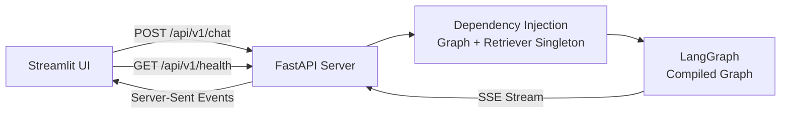
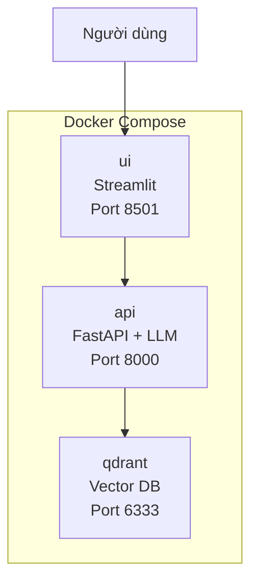

# Phase 4: API, Giao Diện Chatbot & Deployment

> Tầng tiếp xúc trực tiếp với người dùng. Kết hợp sức mạnh của FastAPI streaming với giao diện Streamlit Chat để tạo trải nghiệm tương tác mượt mà, kèm trích dẫn nguồn pháp lý minh bạch.

---

## 1. Backend (FastAPI)

### Kiến trúc



### API Endpoints

| Method | Path | Chức năng | Response |
|--------|------|-----------|----------|
| `POST` | `/api/v1/chat` | Nhận câu hỏi, chạy LangGraph, stream câu trả lời | SSE stream (text/event-stream) |
| `GET` | `/api/v1/health` | Kiểm tra trạng thái hệ thống | JSON: model status, DB status, uptime |

### Pydantic Schemas (`api/models/chat.py`)

```python
class ChatRequest(BaseModel):
    message: str                          # Câu hỏi của người dùng
    session_id: str = Field(default_factory=lambda: str(uuid4()))
    chat_history: List[dict] = []         # [{role: "user"/"assistant", content: "..."}]

class Citation(BaseModel):
    article: str                          # "Điều 4"
    doc_id: str                           # "04/2017/QH14"
    doc_title: str                        # "Luật Hỗ trợ DNNVV"
    text_preview: str                     # 300 ký tự đầu của chunk
    score: float                          # Relevance score [0-1]

class ChatResponse(BaseModel):
    answer: str                           # Câu trả lời hoàn chỉnh
    citations: List[Citation]             # Danh sách nguồn trích dẫn
    hallucinated_count: int = 0           # Số Điều bị phát hiện bịa (debug)
```

### Streaming via SSE

```python
@router.post("/api/v1/chat")
async def chat_endpoint(request: ChatRequest):
    async def event_generator():
        state = {
            "question": request.message,
            "chat_history": request.chat_history,
        }
        # Chạy graph — mỗi node hoàn thành sẽ yield event
        result = graph.invoke(state)
        
        # Stream câu trả lời từng phần
        for token in result["final_answer"]:
            yield f"data: {json.dumps({'type': 'token', 'content': token})}\n\n"
        
        # Gửi citations cuối cùng
        yield f"data: {json.dumps({'type': 'citations', 'data': result['citations']})}\n\n"
        yield "data: [DONE]\n\n"
    
    return StreamingResponse(event_generator(), media_type="text/event-stream")
```

### Dependency Injection (`api/dependencies.py`)

```python
# Singleton pattern — load model 1 lần duy nhất khi server khởi động
@lru_cache()
def get_retriever() -> HybridLegalRetriever:
    return HybridLegalRetriever(...)

@lru_cache()
def get_graph() -> CompiledGraph:
    return build_legal_chat_graph(retriever=get_retriever())
```

### Session Management

- Mỗi `session_id` duy trì `chat_history` riêng.
- Lưu trữ in-memory (dict) cho MVP, có thể chuyển sang Redis cho production.
- Giới hạn `chat_history` tối đa 10 lượt gần nhất để không vượt context window.

### Error Handling

| Lỗi | HTTP Code | Phản hồi |
|-----|-----------|----------|
| LLM timeout | 504 | "Hệ thống đang quá tải, vui lòng thử lại." |
| Qdrant unreachable | 503 | "Cơ sở dữ liệu tạm thời không khả dụng." |
| Input quá dài (> 2000 ký tự) | 422 | Validation error |
| Lỗi không xác định | 500 | Generic error + log chi tiết |

---

## 2. Frontend (Streamlit Chat UI)

### Layout chính (`ui/app.py`)

```text
┌─────────────────────────────────────────────────────┐
│  ⚖️ Legal AI — Trợ lý Pháp lý Thông minh           │
├──────────────┬──────────────────────────────────────┤
│  Sidebar     │  Chat Area                           │
│              │                                      │
│  🔧 Model    │  👤 User: "Thành lập công ty TNHH    │
│  Config      │  cần những gì?"                      │
│              │                                      │
│  📋 Session  │  🤖 AI: "Theo Điều 22 Luật Doanh     │
│  History     │  nghiệp 2020..."                     │
│              │                                      │
│  ℹ️ About    │  ┌──────────────────────────────────┐ │
│              │  │ 📎 Nguồn tham chiếu (3 điều)     │ │
│              │  │  ▸ Điều 22 - Luật Doanh nghiệp   │ │
│              │  │  ▸ Điều 46 - Luật Doanh nghiệp   │ │
│              │  │  ▸ Điều 3 - NĐ 01/2021/NĐ-CP     │ │
│              │  └──────────────────────────────────┘ │
│              │                                      │
│              │  💬 [Nhập câu hỏi pháp lý...]        │
└──────────────┴──────────────────────────────────────┘
```

### Citation Card (`ui/components/citation_card.py`)

Mỗi câu trả lời kèm theo **Expander** hiển thị nguồn:

```python
with st.expander(f"📎 Nguồn tham chiếu ({len(citations)} điều luật)"):
    for cite in citations:
        st.markdown(f"**{cite['article']}** — {cite['doc_title']}")
        st.caption(f"Mã VB: {cite['doc_id']} | Relevance: {cite['score']:.0%}")
        st.text(cite['text_preview'])
        st.divider()
```

**Giá trị:** Người dùng có thể đối chiếu ngay văn bản gốc, không cần mở tab tra Google. Độ tin cậy sản phẩm tăng đáng kể.

### SSE Consumer (`ui/api_client.py`)

```python
def stream_chat(message: str, history: list) -> Generator:
    """Consume SSE stream từ FastAPI, yield từng token."""
    response = requests.post(
        f"{API_BASE}/api/v1/chat",
        json={"message": message, "chat_history": history},
        stream=True,
    )
    for line in response.iter_lines():
        if line.startswith(b"data: "):
            data = json.loads(line[6:])
            if data == "[DONE]":
                break
            yield data
```

---

## 3. Deployment (Docker Compose)

### Cấu trúc Container



### docker-compose.yml

```yaml
version: "3.9"
services:
  qdrant:
    image: qdrant/qdrant:latest
    ports: ["6333:6333"]
    volumes: ["./storage:/qdrant/storage"]
  
  api:
    build:
      context: .
      dockerfile: deployment/Dockerfile.api
    ports: ["8000:8000"]
    depends_on: [qdrant]
    environment:
      - QDRANT_HOST=qdrant
      - QDRANT_PORT=6333
    volumes: ["./data:/app/data"]
  
  ui:
    build:
      context: .
      dockerfile: deployment/Dockerfile.ui
    ports: ["8501:8501"]
    depends_on: [api]
    environment:
      - API_BASE_URL=http://api:8000
```

### Dockerfile.api (trọng điểm)

```dockerfile
FROM python:3.11-slim
WORKDIR /app
COPY requirements.txt .
RUN pip install --no-cache-dir -r requirements.txt
COPY src/ ./src/
COPY config/ ./config/
COPY pyproject.toml .
RUN pip install -e .
EXPOSE 8000
CMD ["uvicorn", "src.api.main:app", "--host", "0.0.0.0", "--port", "8000"]
```

---

## 4. Monitoring & Observability

| Thành phần | Công cụ | Mục đích |
|-----------|---------|----------|
| Structured Logging | `logging.yaml` + Python logger | Trace từng request qua các Node |
| Latency Tracking | FastAPI middleware | Đo TTFT, total response time |
| Error Rate | Exception handler + counter | Alert khi error rate > 5% |
| Retrieval Quality | Log top-K scores per query | Phát hiện degradation sớm |
