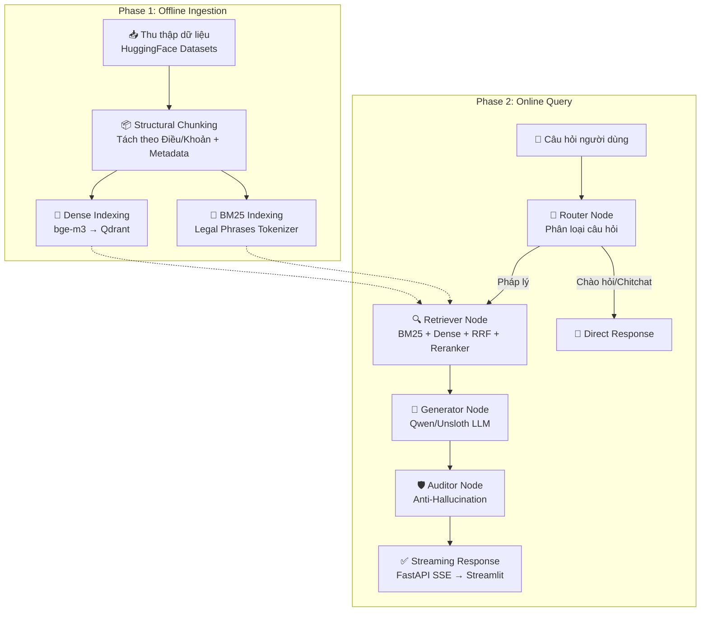

# Kế Hoạch & Bối Cảnh Bài Toán — Legal AI Chatbot

> **Xuất xứ**: Xây dựng lại từ pipeline Legal RAG cuộc thi AIGuru (R2AI2026) — chuyển đổi từ "batch answer 2000 câu hỏi" thành một **Chatbot tương tác thời gian thực** phục vụ tra cứu pháp luật Việt Nam.

---

## 1. Bối Cảnh Bài Toán & Lý Do Triển Khai

Pháp luật Việt Nam có khối lượng văn bản khổng lồ, chồng chéo và thường xuyên được cập nhật (Luật, Nghị định, Thông tư, Án lệ). Đối với các doanh nghiệp SME hay người dân không chuyên, việc tra cứu và hiểu đúng để áp dụng vào thực tế (hợp đồng, thuế, lao động...) tốn rất nhiều chi phí tư vấn.

### Nhu cầu thực tế

Người dùng cần một hệ thống **Hỏi - Đáp Pháp lý (Chatbot)** có thể:
1. Trả lời ngay lập tức các thắc mắc bằng tiếng Việt tự nhiên.
2. Trích dẫn **chính xác** các căn cứ pháp lý (Luật nào, Điều mấy, Khoản nào).
3. Đưa ra hướng dẫn thực tiễn mà không bịa đặt nội dung (Zero Hallucination đối với số liệu/điều luật).
4. Hỗ trợ hội thoại nhiều lượt (multi-turn) — người dùng có thể hỏi tiếp để làm rõ.

### Rủi ro từ LLM nguyên bản (không RAG)

| Rủi ro | Mô tả | Hậu quả |
|--------|-------|---------|
| Ảo giác (Hallucination) | LLM bịa ra "Điều 15 Luật XYZ" không hề tồn tại | Tư vấn sai, rủi ro pháp lý cho người dùng |
| Nhầm lẫn chéo | Lấy nội dung Luật A ghép số hiệu Luật B | "Râu ông nọ cắm cằm bà kia" |
| Kiến thức cũ | Kiến thức bị khóa tại thời điểm huấn luyện | Bỏ sót các sửa đổi, bổ sung mới nhất |
| Không trích dẫn | Không thể chỉ ra nguồn gốc câu trả lời | Người dùng không thể kiểm chứng |

### Giải pháp cốt lõi

Xây dựng hệ thống **RAG (Retrieval-Augmented Generation)** chuyên sâu, thiết kế theo kiến trúc **đa tác tử (Multi-Agent via LangGraph)**, kết hợp **Hybrid Search đa tầng** (BM25 + Dense + Reranking) nhằm đảm bảo AI chỉ trả lời dựa trên kho văn bản luật quy chuẩn.

---

## 2. Bảng Công Nghệ (Tech Stack)

| Thành phần | Công nghệ | Ghi chú |
|------------|-----------|---------|
| **LLM chính** | Qwen2.5-7B-Instruct (Unsloth 4-bit) | Fallback: Ollama local hoặc Gemini API |
| **Embedding** | BAAI/bge-m3 (1024-dim, multilingual) | Hỗ trợ tiếng Việt rất tốt |
| **Reranker** | BAAI/bge-reranker-v2-m3 | Cross-encoder chấm lại Top 30 |
| **Vector DB** | Qdrant (embedded/local mode) | Persistent, hỗ trợ hybrid search |
| **Sparse Search** | BM25Okapi (rank_bm25) | Tokenizer: Regex Legal Phrases |
| **Agent Framework** | LangGraph | Stateful graph, conditional edges |
| **Backend** | FastAPI + SSE | Streaming response |
| **Frontend** | Streamlit | Chat UI + Citation expanders |
| **Deployment** | Docker Compose | API + UI + Qdrant containers |

---

## 3. Kiến Trúc Tổng Quan (System Architecture)



---

## 4. Phân Tích Chi Tiết Các Tầng Xử Lý

### Tầng 1: Data Ingestion & Structural Chunking
- **Thu thập:** Tải Pháp điển (config `articles` subset) và Án lệ từ HuggingFace, chuẩn hóa thành JSONL.
- **Structural Chunking:** Cắt dựa trên cấu trúc văn bản: **từng Điều độc lập**. Nếu Điều dài > 8000 ký tự → tách theo Khoản.
- **Metadata Injection:** Mỗi Chunk mang `doc_id`, `doc_type`, `doc_title`, `article_number`, `formatted_doc`, `formatted_article` — sẵn sàng dùng cho trích dẫn.

### Tầng 2: Multi-Layer Hybrid Retrieval
Một câu hỏi pháp lý chứa cả từ khóa chính xác ("vốn điều lệ", "04/2017/QH14") lẫn diễn đạt ngữ nghĩa ("phạt chậm nộp thuế"). Do đó dùng kiến trúc 3 bước:
1. **BM25 (Sparse):** Truy vấn từ khóa chính xác → Top 50.
2. **Dense (bge-m3 + Qdrant):** Truy vấn ngữ nghĩa → Top 50.
3. **RRF + Reranker:** Trộn bằng Reciprocal Rank Fusion (k=60), đẩy Top 30 qua Cross-Encoder → chọn Top 5-10.

**Context Formatting:** Nhóm chunks theo `doc_id`, render dưới dạng `[VĂN BẢN N]` tường minh để LLM không nhầm Điều giữa các văn bản khác nhau.

### Tầng 3: Multi-Agent Logic (LangGraph)
Thay vì prompt đơn, Chatbot dùng luồng đồ thị có trạng thái:
- **Router Node:** Phân loại câu hỏi (pháp lý vs. chitchat).
- **Retriever Node:** Kích hoạt Hybrid Search.
- **Generator Node:** Sinh câu trả lời theo format: `Căn cứ → Phân tích → Tư vấn → Cảnh báo`.
- **Auditor Node:** Regex bóc tách "Điều X" → đối chiếu với Context → loại bỏ hallucination → gắn cảnh báo giới hạn AI.

### Tầng 4: Serving & UI
- **Backend FastAPI:** Quản lý chat session, streaming SSE.
- **Frontend Streamlit:** Giao diện chat + Citation Expanders hiển thị toàn văn Điều luật để người dùng kiểm chứng.

---

## 5. Ma Trận Đánh Giá (Evaluation Metrics)

| Metric | Mô tả | Mục tiêu |
|--------|-------|----------|
| **Retrieval Hit Rate @K** | Top K có chứa Điều luật ground truth? | ≥ 85% @ K=10 |
| **Macro F2** | F2 trọng Recall (×4 so với Precision) trên relevant_articles | ≥ 0.65 |
| **Hallucination Rate** | % câu trả lời trích dẫn Điều không tồn tại trong Context | ≤ 2% |
| **TTFT (Time to First Token)** | Thời gian chờ nhận được ký tự đầu tiên | ≤ 2s |
| **Answer Relevance (LLM Judge)** | Đánh giá chất lượng câu trả lời bằng LLM khác | ≥ 4/5 |

---

## 6. Quản Lý Rủi Ro

| Rủi ro | Xác suất | Tác động | Biện pháp |
|--------|----------|----------|-----------|
| VRAM không đủ cho 7B + Reranker | Cao | Không chạy được | Unsloth 4-bit quantization, sequential inference |
| Embedding model kém cho tiếng Việt | Trung bình | Recall thấp | Benchmark bge-m3 vs vietnamese-bi-encoder |
| LLM hallucinate Điều luật | Cao | Tư vấn sai | Auditor Node + Post-processing 3 tầng |
| Dataset cấu trúc phức tạp | Cao | Chunking hỏng | Adapt collector theo cấu trúc thực tế (bài học từ AIGuru) |
| Streamlit giới hạn concurrent users | Trung bình | Không scale | Chuyển sang React + WebSocket nếu cần |

---

## 7. Timeline Phát Triển

```text
Tuần 1:  Phase 1 — Thu thập, Chunking, Metadata Validation
Tuần 2:  Phase 2 — BM25 Index + Qdrant Dense Index + Retriever hoạt động
Tuần 3:  Phase 3 — LangGraph pipeline (Router → Retriever → Generator → Auditor)
Tuần 4:  Phase 4 — FastAPI SSE + Streamlit Chat UI + Docker
Tuần 5:  Evaluation + Tuning thresholds + Demo
```
